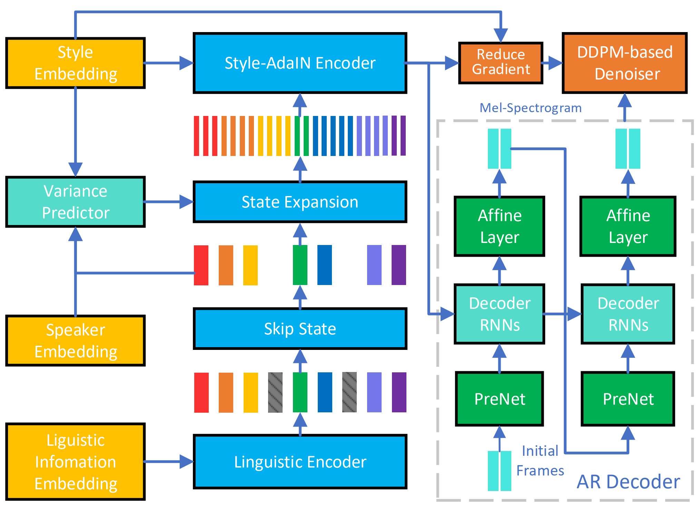

# 
 DurIAN-E:  Duration Informed Attention Network For Expressive Text-to-Speech Synthesis

 
## Abstract

 This paper introduces an improved  duration informed attention neural network (DurIAN-E) for expressive and high-fidelity  text-to-speech  (TTS) synthesis.  Inherited from the original DurIAN model, an auto-regressive model structure in which the alignments between the input linguistic information and the output acoustic features are inferred from a duration model is adopted. Meanwhile the proposed DurIAN-E utilizes multiple stacked SwishRNN-based Transformer blocks as linguistic encoders.
Style-Adaptive Instance Normalization (SAIN) layers are exploited into 
frame-level encoders to improve the modeling ability of expressiveness.
A  denoiser incorporating both  denoising diffusion probabilistic model (DDPM) for mel-spectrograms and SAIN modules is conducted to further improve the synthetic  speech quality and expressiveness.
Experimental results prove that the proposed expressive TTS model in this paper can achieve better performance than the state-of-the-art approaches  in both subjective mean opinion score (MOS) and preference tests. 
 

 

 

## Sound Samples

\* Note: All samples are in Mandrin Chinese.

 
## synthesized demos from different systems
 
 

<table align="center">
  <thead>
    <tr>
      <th>System</th>
      <th>Demo1</th>
      <th>Demo2</th>
    </tr>
  </thead>
  <tbody>
    
   <tr>
      <td>GT (vocoder) </td>
      <td><audio controls="" preload="auto">
            <source src="wavs/gt/test01.wav"></audio></td>
       <td><audio controls="" preload="auto">
            <source src="wavs/gt/test02.wav"></audio></td>
     
   </tr>
   <tr>
   <td>FastSpeech 2 </td>
    <td><audio controls="" preload="auto">
            <source src="wavs/fs/test01.wav"></audio></td>
    <td><audio controls="" preload="auto">
            <source src="wavs/fs/test02.wav"></audio></td>
    
   </tr>
   <tr>
    <td>DurIAN </td>
     <td><audio controls="" preload="auto">
            <source src="wavs/durian/test01.wav"></audio></td>
    <td><audio controls="" preload="auto">
            <source src="wavs/durian/test02.wav"></audio></td>
   </tr>
   <tr>
    <td>DiffSpeech </td>
     <td><audio controls="" preload="auto">
            <source src="wavs/ds/test01.wav"></audio></td>
    <td><audio controls="" preload="auto">
            <source src="wavs/ds/test02.wav"></audio></td>
   </tr>
   <tr>
    <td>DurIAN-E </td>
     <td><audio controls="" preload="auto">
            <source src="wavs/duriane/test01.wav"></audio></td>
    <td><audio controls="" preload="auto">
            <source src="wavs/duriane/test02.wav"></audio></td>
   </tr>
  </tbody>
</table>
 
<table align="center">
  <thead>
    <tr>
      <th>System</th>
      <th>Demo3</th>
      <th>Demo4</th>
    </tr>
  </thead>
  <tbody>
    
   <tr>
      <td>GT (vocoder) </td>
      <td><audio controls="" preload="auto">
            <source src="wavs/gt/test03.wav"></audio></td>
       <td><audio controls="" preload="auto">
            <source src="wavs/gt/test04.wav"></audio></td>
     
   </tr>
   <tr>
   <td>FastSpeech 2 </td>
    <td><audio controls="" preload="auto">
            <source src="wavs/fs/test03.wav"></audio></td>
    <td><audio controls="" preload="auto">
            <source src="wavs/fs/test04.wav"></audio></td>
    
   </tr>
   <tr>
    <td>DurIAN </td>
     <td><audio controls="" preload="auto">
            <source src="wavs/durian/test03.wav"></audio></td>
    <td><audio controls="" preload="auto">
            <source src="wavs/durian/test04.wav"></audio></td>
   </tr>
   <tr>
    <td>DiffSpeech </td>
     <td><audio controls="" preload="auto">
            <source src="wavs/ds/test03.wav"></audio></td>
    <td><audio controls="" preload="auto">
            <source src="wavs/ds/test04.wav"></audio></td>
   </tr>
   <tr>
    <td>DurIAN-E </td>
     <td><audio controls="" preload="auto">
            <source src="wavs/duriane/test03.wav"></audio></td>
    <td><audio controls="" preload="auto">
            <source src="wavs/duriane/test04.wav"></audio></td>
   </tr>
  </tbody>
</table>

 

<table align="center">
  <thead>
    <tr>
      <th>System</th>
      <th>Demo5</th>
      <th>Demo6</th>
    </tr>
  </thead>
  <tbody>
    
   <tr>
      <td>GT (vocoder) </td>
      <td><audio controls="" preload="auto">
            <source src="wavs/gt/test05.wav"></audio></td>
       <td><audio controls="" preload="auto">
            <source src="wavs/gt/test06.wav"></audio></td>
     
   </tr>
   <tr>
   <td>FastSpeech 2 </td>
    <td><audio controls="" preload="auto">
            <source src="wavs/fs/test05.wav"></audio></td>
    <td><audio controls="" preload="auto">
            <source src="wavs/fs/test06.wav"></audio></td>
    
   </tr>
   <tr>
    <td>DurIAN </td>
     <td><audio controls="" preload="auto">
            <source src="wavs/durian/test05.wav"></audio></td>
    <td><audio controls="" preload="auto">
            <source src="wavs/durian/test06.wav"></audio></td>
   </tr>
   <tr>
    <td>DiffSpeech </td>
     <td><audio controls="" preload="auto">
            <source src="wavs/ds/test05.wav"></audio></td>
    <td><audio controls="" preload="auto">
            <source src="wavs/ds/test06.wav"></audio></td>
   </tr>
   <tr>
    <td>DurIAN-E </td>
     <td><audio controls="" preload="auto">
            <source src="wavs/duriane/test05.wav"></audio></td>
    <td><audio controls="" preload="auto">
            <source src="wavs/duriane/test06.wav"></audio></td>
   </tr>
  </tbody>
</table>

 
<table align="center">
  <thead>
    <tr>
      <th>System</th>
      <th>Demo7</th>
      <th>Demo8</th>
    </tr>
  </thead>
  <tbody>
    
   <tr>
      <td>GT (vocoder) </td>
      <td><audio controls="" preload="auto">
            <source src="wavs/gt/test07.wav"></audio></td>
       <td><audio controls="" preload="auto">
            <source src="wavs/gt/test08.wav"></audio></td>
     
   </tr>
   <tr>
   <td>FastSpeech 2 </td>
    <td><audio controls="" preload="auto">
            <source src="wavs/fs/test07.wav"></audio></td>
    <td><audio controls="" preload="auto">
            <source src="wavs/fs/test08.wav"></audio></td>
    
   </tr>
   <tr>
    <td>DurIAN </td>
     <td><audio controls="" preload="auto">
            <source src="wavs/durian/test07.wav"></audio></td>
    <td><audio controls="" preload="auto">
            <source src="wavs/durian/test08.wav"></audio></td>
   </tr>
   <tr>
    <td>DiffSpeech </td>
     <td><audio controls="" preload="auto">
            <source src="wavs/ds/test07.wav"></audio></td>
    <td><audio controls="" preload="auto">
            <source src="wavs/ds/test08.wav"></audio></td>
   </tr>
   <tr>
    <td>DurIAN-E </td>
     <td><audio controls="" preload="auto">
            <source src="wavs/duriane/test07.wav"></audio></td>
    <td><audio controls="" preload="auto">
            <source src="wavs/duriane/test08.wav"></audio></td>
   </tr>
  </tbody>
</table>

 
<table align="center">
  <thead>
    <tr>
      <th>System</th>
      <th>Demo9</th>
      <th>Demo10</th>
    </tr>
  </thead>
  <tbody>
    
   <tr>
      <td>GT (vocoder) </td>
      <td><audio controls="" preload="auto">
            <source src="wavs/gt/test09.wav"></audio></td>
       <td><audio controls="" preload="auto">
            <source src="wavs/gt/test10.wav"></audio></td>
     
   </tr>
   <tr>
   <td>FastSpeech 2 </td>
    <td><audio controls="" preload="auto">
            <source src="wavs/fs/test09.wav"></audio></td>
    <td><audio controls="" preload="auto">
            <source src="wavs/fs/test10.wav"></audio></td>
    
   </tr>
   <tr>
    <td>DurIAN </td>
     <td><audio controls="" preload="auto">
            <source src="wavs/durian/test09.wav"></audio></td>
    <td><audio controls="" preload="auto">
            <source src="wavs/durian/test10.wav"></audio></td>
   </tr>
   <tr>
    <td>DiffSpeech </td>
     <td><audio controls="" preload="auto">
            <source src="wavs/ds/test09.wav"></audio></td>
    <td><audio controls="" preload="auto">
            <source src="wavs/ds/test10.wav"></audio></td>
   </tr>
   <tr>
    <td>DurIAN-E </td>
     <td><audio controls="" preload="auto">
            <source src="wavs/duriane/test09.wav"></audio></td>
    <td><audio controls="" preload="auto">
            <source src="wavs/duriane/test10.wav"></audio></td>
   </tr>
  </tbody>
</table>

 
## Ablation test demos
### system description
- DurIAN-E: The proposed system
- DurIAN-E-postnet: The model using post-net in Tacotron2 as the denoiser instead of DDPM
- DurIAN-E-ffn: Using standard Transformers as the linguistic encoder instead of SwishRNN-based ones
 
<table align="center">
 <thead>
    <tr>
      <th>System</th>
      <th>Demo01</th>
      <th>Demo02</th>
    </tr>
  </thead>
  <tbody>
    
  
   <tr>
    <td>DurIAN-E </td>
     <td><audio controls="" preload="auto">
            <source src="wavs/abx/duriane/test01.wav"></audio></td>
    <td><audio controls="" preload="auto">
            <source src="wavs/abx/duriane/test02.wav"></audio></td>
   </tr>
    <tr>
      <td>DurIAN-E-postnet </td>
      <td><audio controls="" preload="auto">
            <source src="wavs/abx/duriane-e-postnet/test01.wav"></audio></td>
       <td><audio controls="" preload="auto">
            <source src="wavs/abx/duriane-e-postnet/test02.wav"></audio></td>
     
   </tr>
   <tr>
   <td>DurIAN-E-ffn</td>
    <td><audio controls="" preload="auto">
            <source src="wavs/abx/duriane-e-ffn/test01.wav"></audio></td>
    <td><audio controls="" preload="auto">
            <source src="wavs/abx/duriane-e-ffn/test02.wav"></audio></td>
    
   </tr>
  </tbody>
</table>
 
<table align="center">
 <thead>
    <tr>
      <th>System</th>
      <th>Demo03</th>
      <th>Demo04</th>
    </tr>
  </thead>
  <tbody>
    
  
   <tr>
    <td>DurIAN-E </td>
     <td><audio controls="" preload="auto">
            <source src="wavs/abx/duriane/test03.wav"></audio></td>
    <td><audio controls="" preload="auto">
            <source src="wavs/abx/duriane/test04.wav"></audio></td>
   </tr>
    <tr>
      <td>DurIAN-E-postnet </td>
      <td><audio controls="" preload="auto">
            <source src="wavs/abx/duriane-e-postnet/test03.wav"></audio></td>
       <td><audio controls="" preload="auto">
            <source src="wavs/abx/duriane-e-postnet/test04.wav"></audio></td>
     
   </tr>
   <tr>
   <td>DurIAN-E-ffn</td>
    <td><audio controls="" preload="auto">
            <source src="wavs/abx/duriane-e-ffn/test03.wav"></audio></td>
    <td><audio controls="" preload="auto">
            <source src="wavs/abx/duriane-e-ffn/test04.wav"></audio></td>
    
   </tr>
  </tbody>
</table>

 
<table align="center">
 <thead>
    <tr>
      <th>System</th>
      <th>Demo05</th>
      <th>Demo06</th>
    </tr>
  </thead>
  <tbody>
    
  
   <tr>
    <td>DurIAN-E </td>
     <td><audio controls="" preload="auto">
            <source src="wavs/abx/duriane/test05.wav"></audio></td>
    <td><audio controls="" preload="auto">
            <source src="wavs/abx/duriane/test06.wav"></audio></td>
   </tr>
    <tr>
      <td>DurIAN-E-postnet </td>
      <td><audio controls="" preload="auto">
            <source src="wavs/abx/duriane-e-postnet/test05.wav"></audio></td>
       <td><audio controls="" preload="auto">
            <source src="wavs/abx/duriane-e-postnet/test06.wav"></audio></td>
     
   </tr>
   <tr>
   <td>DurIAN-E-ffn</td>
    <td><audio controls="" preload="auto">
            <source src="wavs/abx/duriane-e-ffn/test05.wav"></audio></td>
    <td><audio controls="" preload="auto">
            <source src="wavs/abx/duriane-e-ffn/test06.wav"></audio></td>
    
   </tr>
  </tbody>
</table>